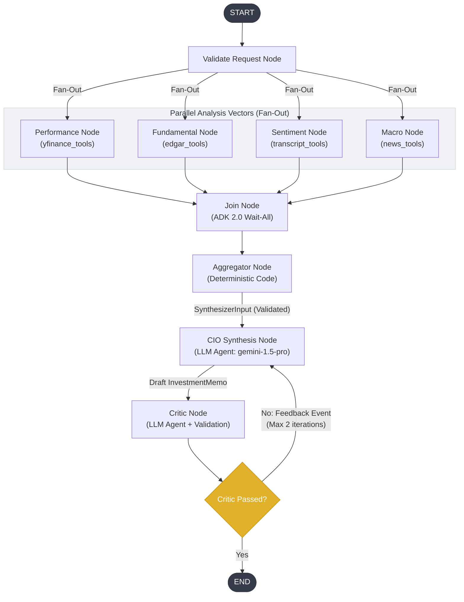
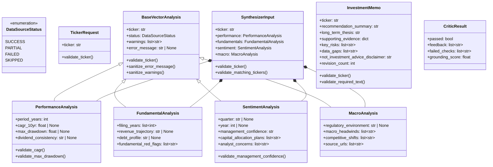

# Codebase Structure

This document details the architecture of the **Market Signal Synthesizer** codebase. It outlines the file/folder layout, the logical runtime dataflow (based on the Google ADK 2.0 Workflow), and the domain schemas.

---

## 1. Directory & Module Layout

The workspace is organized into code sources (`src/portfolio_tracker`), test suites (`tests`), design specification plans (`plan`), and metadata files. Planned or suggested components are noted accordingly.

```mermaid
graph TD
    Root["kaggle_5day_agent_portfolio_tracker/"]
    Root --> Src["src/"]
    Root --> Tests["tests/"]
    Root --> Plan["plan/"]
    Root --> PyProject["pyproject.toml"]

    Src --> PT["portfolio_tracker/"]
    PT --> PT_Init["__init__.py"]
    PT --> Schemas["schemas.py (Domain models)"]
    PT --> AgentsDir["agents/"]
    PT --> ToolsDir["tools/"]

    AgentsDir --> AgentsInit["__init__.py"]
    AgentsDir --> PerfAgent["performance.py (Planned)"]
    AgentsDir --> FundAgent["fundamentals.py (Planned)"]
    AgentsDir --> SentAgent["sentiment.py (Planned)"]
    AgentsDir --> MacroAgent["macro.py (Planned)"]
    AgentsDir --> CIOAgent["cio.py (Planned)"]
    AgentsDir --> CriticAgent["critic.py (Planned)"]

    ToolsDir --> ToolsInit["__init__.py"]
    ToolsDir --> YF_Tools["yfinance_tools.py (Planned)"]
    ToolsDir --> Edgar_Tools["edgar_tools.py (Planned)"]
    ToolsDir --> Trans_Tools["transcript_tools.py (Planned)"]
    ToolsDir --> News_Tools["news_tools.py (Planned)"]

    Tests --> UnitTests["unit/"]
    Tests --> IntegrationTests["integration/ (Planned)"]
    Tests --> Fixtures["fixtures/"]
    Tests --> Conftest["conftest.py (Offline execution mock)"]

    UnitTests --> TTestSchemas["test_schemas.py"]
    UnitTests --> TTestNetGuard["test_network_guard.py"]
    UnitTests --> TTestPkg["test_package_import.py"]

    Fixtures --> F1["macro_news_sample.json"]
    Fixtures --> F2["price_history_sample.json"]
    Fixtures --> F3["sec_filing_summary_sample.json"]
    Fixtures --> F4["transcript_qa_sample.txt"]

    Plan --> PlanIdea["idea_gemini.md"]
    Plan --> PlanTDD["implementation_plan_tdd_revised.md"]
    
    style Root fill:#1d2021,stroke:#3c3836,stroke-width:2px,color:#ebdbb2
    style Src fill:#458588,stroke:#458588,color:#fbf1c7
    style Tests fill:#cc241d,stroke:#cc241d,color:#fbf1c7
    style Plan fill:#98971a,stroke:#98971a,color:#fbf1c7
```

---

## 2. Execution Flow Directed Acyclic Graph (DAG)

The logical execution flow runs concurrently during data collection (Fan-Out) and aggregates the outputs (Fan-In) to feed the LLM analysis and verification loops.

---

## 3. Domain Schema Relationships

The Pydantic schemas in [schemas.py](file:///home/hk/Documents/code/kaggle_agent/kaggle_5day_agent_portfolio_tracker/src/portfolio_tracker/schemas.py) define the core data contracts between the data gathering tools, the aggregator, the synthesizer, and the critic.

